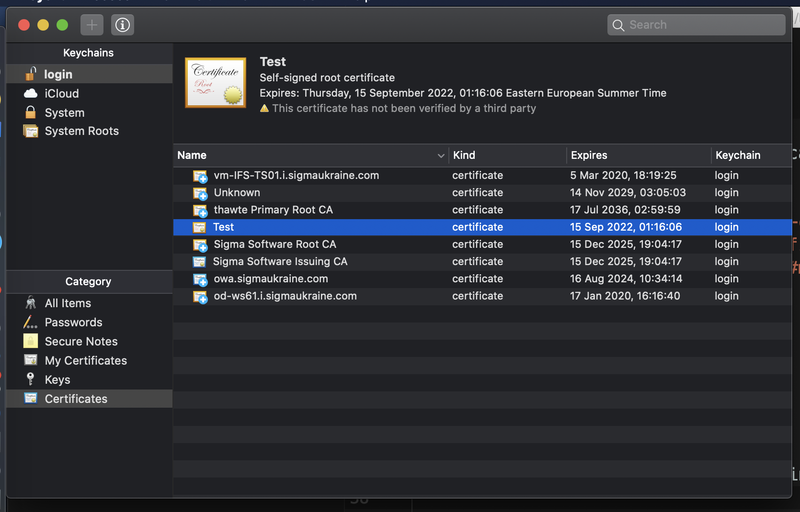
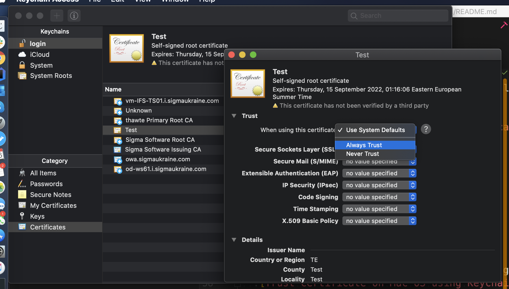

# valid-local-certificate
How to generate valid HTTPS certificate for local development environment

## Table of Content
1. [Before you begin](#before-begin)
1. [Root SSL certificate](#root-ssl-certificate)
1. [Trust certificate](#trust-certificate)
   * [Trust certificate on Mac OS](#mac-os)
1. [Domain SSL certificate](#domain-ssl-certificate)
1. [Usage: NodeJS](#usage)

## Before begin

All ssl certificates operations are going to be done in [`/path/to/certs` folder](certs).

## Root SSL certificate

Generate private RSA with password: `password`

```bash
openssl genrsa -des3 -out rootCA.key 2048
# Generating RSA private key, 2048 bit long modulus
# .........+++
# ...........................................................+++
# e is 65537 (0x10001)
# Enter pass phrase for rootCA.key:
# Enter pass phrase for rootCA.key:
# Verifying - Enter pass phrase for rootCA.key:
```

NOTE: result is in [`rootCA.key`](certs/rootCA.key) file.

Use key you generated to create a new Root
SSL certificate:

```bash
openssl req -x509 -new -nodes -key rootCA.key -sha256 -days 1024 -out rootCA.pem
```

NOTE: result is in [`rootCA.pem`](certs/rootCA.pem) file.

## Trust certificate

### Mac OS

* Open Keychain Access on your Mac
* `File` -> `Import items...` -> point your generated [`rootCA.pem`](certs/rootCA.pem) certificate
  
* Double click on certificate and under `Trust` menu chose `Always Trust`
  

## Domain SSL certificate

Previously created root SSL certificate now can be
used to issue a certificate specifically for your local
development environment located at localhost.

Create a new OpenSSL configuration file named
[`server.csr.cnf`](certs/server.csr.cnf) so you can import these settings when
creating a certificate instead of entering them on the
command line:

```ini
[req]
default_bits = 2048
prompt = no
default_md = sha256
distinguished_name = dn

[dn]
C=US
ST=RandomState
L=RandomCity
O=RandomOrganization
OU=RandomOrganizationUnit
emailAddress=hello@example.com
CN = localhost
```

Create a [`v3.ext`](certs/v3.ext) file in order to create a X509 v3 certificate.

NOTE: we’re specified `subjectAltName`

```ini
authorityKeyIdentifier=keyid,issuer
basicConstraints=CA:FALSE
keyUsage = digitalSignature, nonRepudiation, keyEncipherment, dataEncipherment
subjectAltName = @alt_names

[alt_names]
DNS.1 = localhost
```

NOTE: result is in [`v3.ext`](certs/v3.ext) file.

Create a certificate key for `localhost` by using
the configuration settings stored in [`server.csr.cnf`](certs/server.csr.cnf)
file:

```bash
openssl req -new -sha256 -nodes \
    -out server.csr -newkey rsa:2048 \
    -keyout server.key -config <(cat server.csr.cnf)
```

NOTE: results are in [`server.key`](certs/server.key) and [`server.crt`](certs/server.crt) files.

Certificate signing request is issued via the root SSL certificate
we created earlier to create a `domain certificate` for localhost.
Use password: `password`

```bash
openssl x509 -req -in server.csr -CA rootCA.pem \
    -CAkey rootCA.key -CAcreateserial \
    -out server.crt -days 500 -sha256 -extfile v3.ext
```

NOTE: results are in [`server.crt`](certs/server.crt) and [`rootCA.srl`](certs/rootCA.srl) files.

## Usage

Let's secure our `localhost` host!

Let's implement simple node.js express backend server to simulate.

```bash
mkdir -p /tmp/app/certs /tmp/app/public
cd /tmp/app
npm init -y
npm i -DE express fs-extra @types/node
echo '<html><body><h3>Aloha!</h3></body></html>' > ./public/index.html
vi app.js
```

```js
const fs = require('fs-extra');
const path = require('path');
const https = require('https');
const express = require('express');

const app = express();
app.use(express.static('public'));

const port = process.env.PORT || '443';
const certOptions = {
    key: fs.readFileSync(path.resolve('./server.key')),
    cert: fs.readFileSync(path.resolve('./server.crt'))
};

https.createServer(certOptions, app).listen(port);
```

Copy [`server.key`](certs/server.key) and [`server.crt`](certs/server.crt) files to your server folder.

```bash
cp /path/to/certs/server.key /tmp/app/certs/
cp /path/to/certs/server.crt /tmp/app/certs/
```

Start server:

```bash
node app.js
```

Open and test https://localhost/

```bash
curl https://localhost/
```

NOTE: DO not use https://127.0.0.1/, instead you should use https://localhost/ in your browser.

NOTE: Do not use it in production! BTW, it will valid only locally on your Mac.

## resources

* [According article on freecodecamp.org](https://www.freecodecamp.org/news/how-to-get-https-working-on-your-local-development-environment-in-5-minutes-7af615770eec/)
